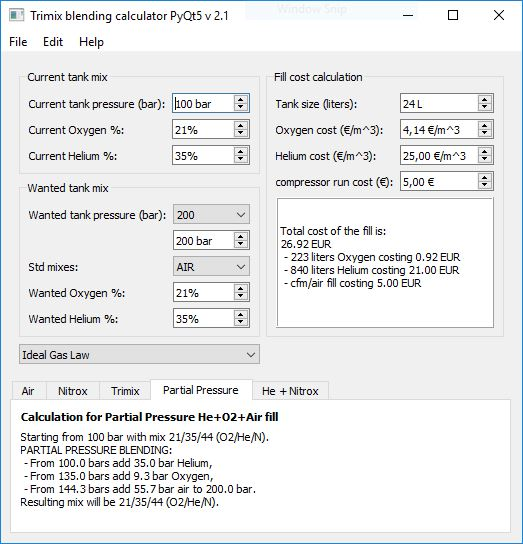

# FillCalc2
FillCalc2.py is an auxiliary tool included in the [pydplan](https://github.com/eianlei/pydplan) for interactive gas mixing calculations.
It will calculate how to blend a technical scuba diving gas mix given the current mix you have in tank and what you want. Several blending methods are available.

There is also a Windows/.NET/C# version _"FillCalcWin"_ at https://github.com/eianlei/FillCalcWin, which is prebuilt and can be installed with a single click without any dev tools.

FillCalc version 2.2 adds Van der Waals gas law that can be used for more accurate partial pressure blending.   

FillCalc2 is a further development of an earlier project at github:
[trimix-fill](https://github.com/eianlei/trimix-fill)

But instead of using TkInter as in trimix-fill, FillCalc2.py uses PyQt5 as graphics library and is more interactive.

# FillCalc2 installation
The tool requires working Python 3.6 or newer and following Python files to run:

file | purpose
------------ | -------------
FillCalc2.py | the PyQt5 GUI defined here, call this module to start the app
tmx_calc.py | Calculations and formulas based on Ideal Gas Law, reusable with no dependecies to UI
vdw_calc.py | Calculation of partial pressure blending based on Van der Waals gas law (under development)

You get these if you clone or pull the entire [pydplan](https://github.com/eianlei/pydplan). Or just download these if you are only interested in this app.
Install following dependencies:

    python -m pip install scipy
    python -m pip install pyqt5

# FillCalc2 usage
start the tool by

    python FillCalc2.py
And you should see the main window

Now simply fill into the widgets the  current and wanted tank mixes.

For partial pressure fills, you can also select the gas law to be used. However, Van der Waals calculation implmentation is under development and not very well tested.

gas law | description
------------ | -------------
Ideal gas law | Calculations are based on solving P * V = n * R * T, where P is the gas pressure, V is the tank volume, n is moles of gas, R is the universal gas constant, T is the system temperature. The equation reduces in this application to P1* n1 = P2* n2 and we can furthermore use the Dalton's law of partial pressures. This method works fairly well for fills up to 200 bar, and for mixes that do not have much Helium. For fills to 300 bar, and/or with significant amounts of Helium, the ideal gas law produces a significant error. However, the calculation is simple and quick and could be done even manually.
Van der Waals | Calculations are based on solving the Van der Waals equation: (p + (n^2 * a /V^2)) * (V-n*b) = n * R * T for each stage of filling. The coefficients a and b depend on the gas mix. As it is a nasty cubic equation, the solution is done numerically by iteration. For each gas mix the a and b coefficients are calculated separately as Dalton's law is no longer applicable in this case. The calculation is complicated and uses a lot of CPU cycles, but the result is much more accurate. Calculation by hand is not by any means practical. Some implementation details at the page [van_der_waals.md](van_der_waals.md)

Finally select the tab of your choice for a fill method:

tab label | fill method
------------ | -------------
Air | You are topping the tank with plain air. Obviously you will not then get the mix you maybe wanted. The app calculates what you will get.
Nitrox |  You are topping the tank with Nitrox CFM. Obviously you will not then get more Helium to the tank, but the app tries to calculate the O2% inflow to match your O2% target. You get error if you want something that cannot be done.
Trimix | You are topping the tank with Trimix CFM. Here we assume you have only one mixing chamber and only one O2 sensor.
Partial Pressure | You are doing a partial pressure (decanting) fill. First fill in Helium, then Oxygen, finally top with air. Often Helium and Oxygen fill is done with a booster pump.
He + Nitrox | You are decanting first pure Helium, then top with Nitrox CFM. Standard trimixes can be made this way.

If the mix you want is possible to make, then under the tab you will see the instructions how to make it. Otherwise you get an error.

The application immediately recalculates when you change anything in the GUI widgets. The calculation using ideal gas law is simple and you should not notice any delay. Van der Waals solution might take a bit longer. The Spinbox widgets can be used by either entering values from keyboard, or then increase/decrease value by clicking up/down arrows. Some values can be selected with comboboxes from a popout menu.

You can try to "simulate bleeding" your tank, if you are not getting the mix you want. Simply decrease the current tank pressure by as much as you would then be bleeding actually, and you might find a solution.

The application assumes that for CFM fills the following Oxygen and Helium flows cannot be exceeded:
- Oxygen max 36%, as your compressor can explode.
- Helium max 32% as your compressor can overheat

On the right hand side there is panel that calculates the cost of your fill.

The menu at the top of the main window is placeholder for future enhancements, and currently does nothing.

# target users
The application is intended for certified [Trimix](https://en.wikipedia.org/wiki/Trimix_(breathing_gas)) gas blenders, who [blend gases](https://en.wikipedia.org/wiki/Gas_blending_for_scuba_diving) for [technical scuba diving](https://en.wikipedia.org/wiki/Technical_diving).

It is assumed that anyone daring to use this application knows what they are doing.

# disclaimers
Use this application at your own risk, the author provides no guarantees about the correctness of the application, and assumes no liability for the use of it for any purpose!

* In no event should you consider blending breathing gases without proper training!
* In no event should you consider scuba diving with mixed gases without proper training!
* Ignoring these warnings can cause your **death** or **serious and permanent injuries**!

# Supported platforms
The script has been tested on
* Windows 7, and 10 with Python 3.6.x and 3.7.x
* Linux: Red Hat 6.8, Ubuntu 18.4 LTS  with Python 3.6.x
* It probably also works on MAC, but I have not tested this.
* Will not run on Android as such. But an Android app might be there in the future...

## Install Python
Latest Python version can be downloaded for free from [www.python.org](https://www.python.org/downloads/)

Python is available for Windows, Linux/UNIX, Mac OS X.

## Python 2 not supported
Script is written for Python 3 and will not work as such in older Python versions.

## PyQt5
GUI depends on PyQt5, you will need to install pyqt5 to your Python.

# Unit system
* Metric and EU units, Imperial units not supported
* decimal separator is dot "." not comma "," (Python default)
* Currently only bar can be used as pressure unit, PSI not supported
* Gas mixes as percentages
* Tank size in liters (cu-ft not supported)
* currency unit is Euro

# Gas laws used for calculation
The calculation formulas used by default are based on the [ideal gas law](https://en.wikipedia.org/wiki/Ideal_gas_law).

A more accurate physical model is the [Van der Waals equation](https://en.wikipedia.org/wiki/Van_der_Waals_equation). Some implementation details at the page [van_der_waals.md](van_der_waals.md)

Adiabatic heating and cooling due to compression and decompression of gases is not taken into account.
