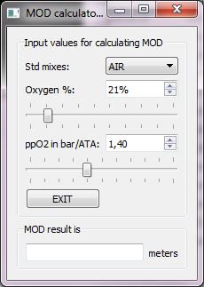

# modCalc2
modCalc2.py is an auxiliary tool for interactive MOD (Maximum Operating Depth) calculation.

# modCalc2 installation
The tool requires two Python files to run:

file | purpose
------------ | -------------
modCalc2.py | everything contained here

You get these if you clone or pull the entire pydplan.
You need Python 3 and PyQt5.

# modCalc2 usage
start the tool by

    python modCalc2.py
And you should see the main window

- Now simply select any standard gas mix from the combobox widget.
- Or use slider or spinbox widget to adjust Oxygen % to the gas mix
- use slider or spinbox widget to adjust partial pressure limit in ATA

The MOD (Maximum Operating Depth) is immediately shown below in meters.

# disclaimers
Use this application at your own risk, the author provides no guarantees about the correctness of the application, and assumes no liability for the use of it for any purpose!

