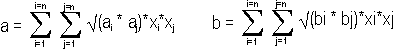
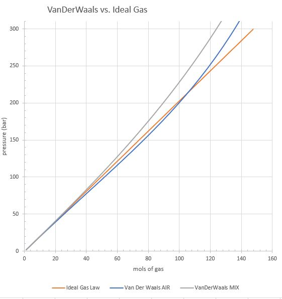

# Van der Waals implementation

Module vdw_calc.py

The procedure for calculating partial pressure fill by van der Waals equation (VDW):

First calculate for the starting and wanted mix the A and B coefficients for those mixes.
Then solve the VDW equation numerically (by iteration) for the n (mols) of total gas, when we know the P, V, a, b, R, T. 

VDW cannot be solved analytically in any nice way as it is cubic, but numerical iteration finds a solution quickly. Python scipy fsolve is used, and as a seed the ideal gas law solution is given.

Then assume we have analyzed the gas O2 and He percentages correctly, so we can calculate how many mols of O2, N2, He gas molecules we have, and will want.

Then calculate for each fill stage what are the resulting mixes, and the VDW a and b for that mix, and total mols at that stage. We can then solve from VDW what is the pressure at that stage, and therefore how many bars of each gas we need to add.

For example: we have 21/35 TMX in 12 liter tank at 20 deg-C, and we want to fill that tank to 200 bars with TMX 21/35. For 21/35 the (a, b) = (0.684, 0.032)
Solving VDW shows that we have 33.8 mols of gas.
We will need to have 89.53554 mols total, and so want to add 11.7 mol O2, 19.5 mol He, 24.5 mol N2.

First we add the Helium, and the resulting mix will be 13/59 and a=0.351, b=0.2868, total 53.332 mol. Solving for VDW we get 117 bar. So we add 47 bar Helium. 

Then we calculate how much Oxygen needs to be added. For that we first need to calculate how much air needs to go on top from N2. As we "need" 24.5 mol of N2 which can only come from air, that air will contain 6.51 mol of O2. Therefore we must first add 5.182 mol O2. Adding that would result into mix of 21/54, for that a=0.415 and b=0.028955. Again solving for VDW we get 128.5 bar. So we must add 11.3 bar O2.

Then top with air.

With ideal gas law (IDG) we would add 45.5 bar He, instead of 47.15 bar 
-- and 12.1 bar O2 instead of 11.30. 
So the resulting mix from IDG has less He and more O2 than what VDW gives. In this case the error is only a few percents, but it is there.

## formula to calculate a and b

a and b for O2, N2 and He are:

| Gas    | a  | b  | molecular weight |
| ------ | ---| --- | ---- |
| Oxygen | 1.382  | 0.03186 | 31.9988
| Nitrogen | 1.370  | 0.03870 | 28.01348
| Helium | 0.0346  | 0.02380 | 4.0020602

a and b for any mix of gases can be calculated by the following formula 

 

This is implemented by the function vdw_mix_ab() to calculate vdw coefficients a and b for a mix of O2, N2, He.

## how big is the difference IDG vs. VDW

The chart below shows the plot of an Ideal Gas Law pressure vs. mols of a gas in 12 liter tank at 20 deg-C. With IDG the plot is the same for any gas and is linear. 

The there are plots using Van der Waals law for air and TMX 21/35. These plots are not linear, and for each gas mix they are quite different. Van der Waals law is much closer to real behaviour of gases, and for the purposes of technical gas blending is accurate enough.

Ideal gas law works pretty well for air and basic Nitrox up to 200 bars. For 300 bar fills and Trimix there will be a big error.

